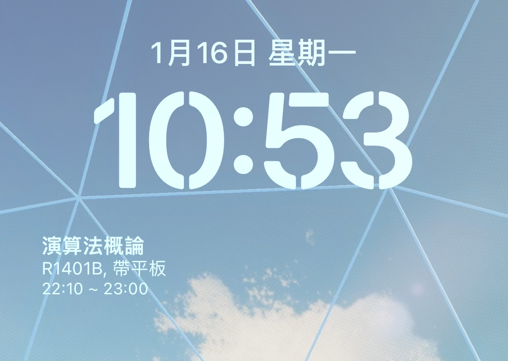

# Scriptable Weekly Schedule

在鎖定畫面顯示每週固定的行程（如課表、週會等）
<p align="center" >
    
</p>

## Setting Up

1. 需先在手機上下載 [Scriptable](https://scriptable.app/)
2. 在 Scriptable 中點擊右上角 + 號新增一份新文件，並複製貼上 `Schedule.js` 中的程式碼
3. 建立 json 檔，這裡提供兩種方法
  - 使用電腦與 iCloud 建立
    1. 在電腦中下載 `schedule_file.json`，或是自己建立一個 json 檔，並複製 `schedule.json` 中的程式碼
    2. 填寫要修改的內容後放至自己的 iCloud > Scriptable 資料夾中
  - 使用 iPhone 建立
    1. 下載可供編輯 json 檔案的程式
    2. 複製 `schedule.json` 中的程式碼，並將檔案放至 iCloud > Scriptable 資料夾中
    3. 填寫所需內容
  - 這裡還需要再作改善，不然這兩種方法都有點小麻煩 QQ
 4. json 檔的編寫規則如下：
   - 需有星期一到日的所有欄位，不得刪除其中任一個
   - 根據需要在星期幾提醒，使用 `{}` 包住單個活動，若需橫跨不同天，需在不同天的 `[] ` 中複製貼上同一活動的資料
   - 變數名稱說明
     - `name` : 活動名稱（如課程名稱等）
     - `describe` : 活動註解（如教室、會議室、小提醒等）
     - `remind time` : 提醒開始的時間，若現在時間晚於提醒時間則會送出提醒
     - `start time` : 活動開始的時間，會顯示於小工具的第三行
     - `end time` : 活動結束的時間，提醒會在過了 end time 後結束，並且此時間也會顯示於小工具的第三行
   - 如果沒有要通知的活動，直接讓 `{}` 中留空白
   - 範例：
     ```json
     {
        "Sunday": [
            {

            }
        ],
        "Monday": [
            {
                "name": "數學邏輯思維",
                "describe": "R2603",
                "remind time": "09:30",
                "start time": "10:10",
                "end time": "12:00"
            },
            {
                "name": "演算法概論",
                "describe": "R1401B, 帶平板",
                "remind time": "22:00",
                "start time": "22:10",
                "end time": "23:00"
            }
          ]
        }
      ```
5. 在手機上進入自訂鎖定畫面
6. 點擊小工具欄，在加入小工具中找到 Scriptable ，加入中型（長方形）小工具
7. 點擊該小工具，選擇 `Schedule` 的 Scriptable
8. 在 Parameter 中輸入剛剛 json 的檔名

9. 小工具將正常顯示

## Customization

可以透過更改程式中的變數來決定是否要顯示活動註解與時間，進入 Schedule.js 後在上方尋找以下兩個變數：
- `showDescription` : 設為 `true` 會顯示 json 中 `describe` 的內容，預設為 `true`
- `showEventTime` : 設為 `true` 會顯示 json 中 `start time` ~ `end time` 的內容

